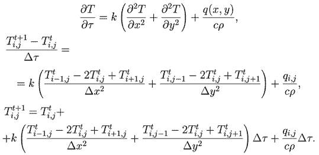

# Уравнение теплопроводности для двумерной расчетной области

Имеется пластина с прямоугольным отверстием. Правая сторона пластины теплоизолирована, остальные поддерживаются при постоянной температуре. В противоположных углах пластины расположены источник тепла и источник холода. Необходимо рассчитать распределение температуры в последовательные моменты времени.

## Явная схема

$\rho c 
\frac{\partial T}{\partial t}
 = k\left(\frac{{\partial }^{2}T}{\partial {x}^{2}}+\frac{{\partial }^{2}\Gamma }{\partial {y}^{2}}\right)+\frac{a\left({x}_{1}y\right)}{\rho c}$

## Источники

1. [МОДЕЛИРОВАНИЕ ТЕПЛОПРОВОДНОСТИ / http://maier-rv.glazov.net/ZAP/gl-7.htm](http://maier-rv.glazov.net/ZAP/gl-7.htm)
2. [Сеченов, П. А. Решение задачи теплопроводности в двухмерной постановке на графическом процессоре с использованием параллельных вычислений / П. А. Сеченов // Вестник Югорского государственного университета. – 2022. – № 2(65). – С. 104-112. – DOI 10.18822/byusu202202104-112. – EDN DSNWDM.](https://www.elibrary.ru/dsnwdm)
3. [Сеченов, П. А. Решение задачи одномерной теплопроводности на графических процессорах с использованием технологии CUDA / П. А. Сеченов, И. А. Рыбенко // Прикладная математика и вопросы управления. – 2021. – № 4. – С. 23-41. – DOI 10.15593/2499-9873/2021.4.02. – EDN OURFOI.](https://www.elibrary.ru/ourfoi)