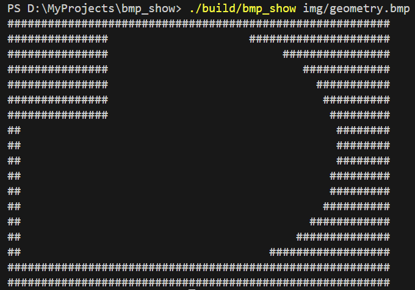

# BMP Show

## Описание

Это программа для чтения и отображения изображений в формате BMP в консоли, а также для их конвертации в черно-белый формат. Программа проверяет, содержит ли изображение более двух цветов, и, если это так, преобразует его в черно-белое изображение, отображая результат в консоли.

**Чёрно-белый формат** подразумевает использование двух цветов: #000 (чёрный) и #fff (белый), в то время как **цветной формат** включает любые другие цвета.
## Функции

- **Чтение BMP-файлов** с глубиной цвета **24 или 32 бита**.
- **Проверка изображения** на наличие более двух цветов.
- **Автоматическое преобразование** в черно-белый формат, если изображение цветное.
- **Отображение изображения** в текстовом виде: символы `#` для белого и пробелы для черного.
- **Обработка исключений**: информативные сообщения об ошибках при неправильных действиях.
- **Многопоточная обработка** для увеличения производительности при конвертации.

## Требования

Для сборки и работы программы необходимы:

- CMake 3.10 или новее.
- Компилятор с поддержкой C++11 и выше (например, `g++` или `clang++`).
- Стандартная библиотека C++.
- Операционная система, поддерживающая работу с консолью.

## Сборка проекта

Для сборки проекта с использованием `CMake`, в терминале перейдите в корневую директорию проекта и выполните следующие команды:

```bash
cmake -S . -B build
cmake --build build
```

## Использование
После компиляции запустите программу, передав путь к BMP-файлу как аргумент:

Например
```bash
./build/bmp_show img/geometry.bmp
```


### Программа выполнит следующие действия:

- Откроет BMP-файл.
- Если изображение содержит более двух цветов, оно будет конвертировано в черно-белое.
- Изображение отобразится в консоли в виде символов # и пробелов.

## Обработка ошибок
Программа обрабатывает следующие ошибки:

- **File open error**: если указанный файл не существует или не может быть открыт.
- **Unsupported BMP format**: если формат BMP не является 24-битным или 32-битным.

Все ошибки выводятся в консоль с информативными сообщениями.

## Многопоточность
Для увеличения производительности программа использует многопоточность при конвертации изображения в черно-белый формат. Это особенно полезно для больших изображений, так как процесс разделяется на максимальное число потоков.

## Результаты



